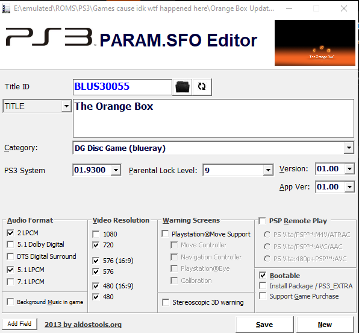

[Skip to the tutorial](#tutorial)

Unedited screenshot from my capture card. There are some strange graphical bugs on the top and bottom (maybe because the framebuffer is oversized) but it works. Performance is pretty abysmal, with quite significant frame drops making the hack difficult to play with. Mostly a proof of concept. Also, the debug information on the top right is not part of the hack, it is part of a save data mod.

Note that this does not work on Portal 2.

**IMPORTANT:** This mod makes the game more likely to hang if the framerate fluctuates. Therefore, this pack is most stable on the least demanding game (Portal). Would not recommend playing Episode 2 with this pack enabled. 

# Tutorial

## You will need:

* A Jailbroken PS3
* A game loader such as multiMAN
* an FTP client (I recommend FileZilla if you don't have FTP already)
* Aldo's PARAM.SFO editor (Check out our [tools page](/tools-of-the-trade/) and grab the collection on PSX Place)

## Instructions

1) Back up your game to your PS3. Do NOT copy as an ISO.

**Note:** This will take up 17GB of space. For those of you with the 12GB/16GB eMMC models, you can upgrade the hard drive, and the PlayStation will guide you through transfering your data from flash storage if so equipped.

2) FTP onto your PS3 and locate your Orange Box install (dev_hdd0/GAMES). Click on PS3_GAME, then download PARAM.SFO to your computer. Open it up. Aldo's PARAM.SFO editor should have made itself the default SFO opener when you installed it earlier.

3) On the bottom left under video resolution, check "1080". Leave the other resolution checkboxes as they are. You can also edit the title that appears on the XMB if so desired, and enable remoteplay (albeit there are better ways to do this systemwide on PS3).

4) Click "Save" on the bottom right.

5) Transfer this file back onto your PS3, when asked to deal with file conflict, overwrite the file. Your PS3 will now run the game in 1080p as long as your video settings allow 1080p content.

# Extra screenshots

