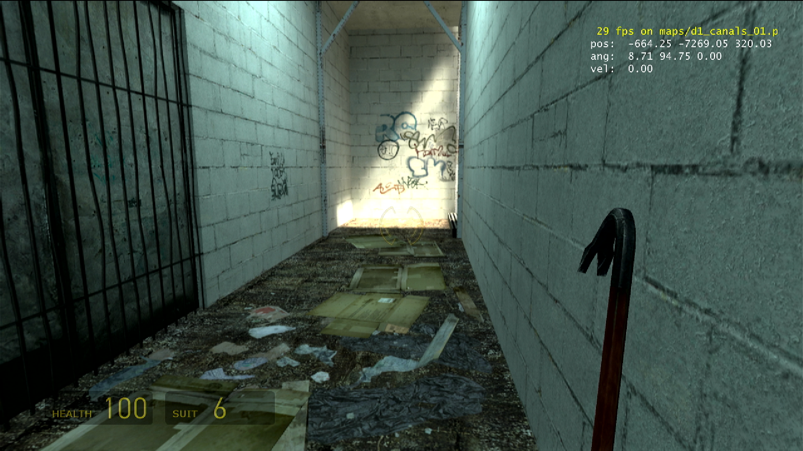
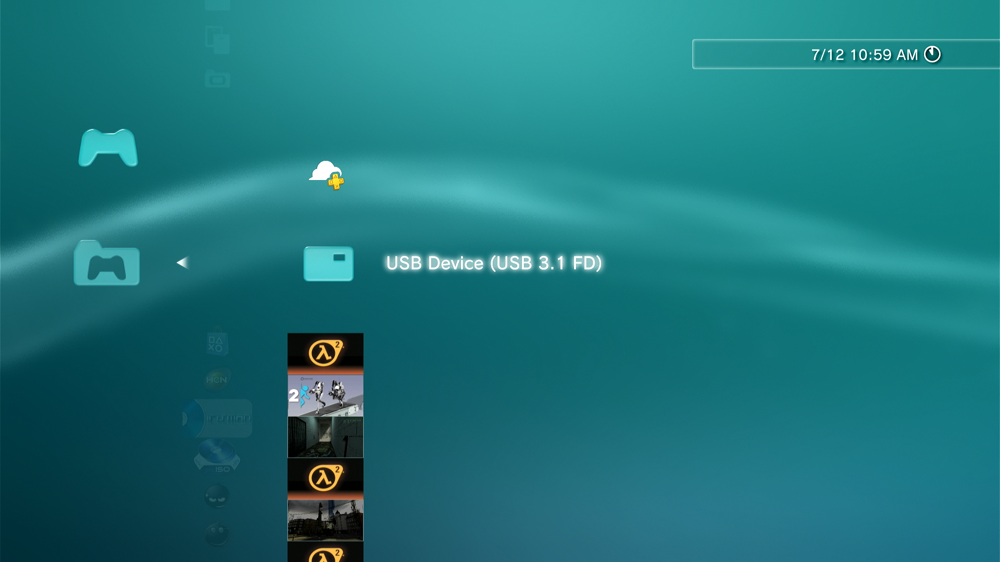
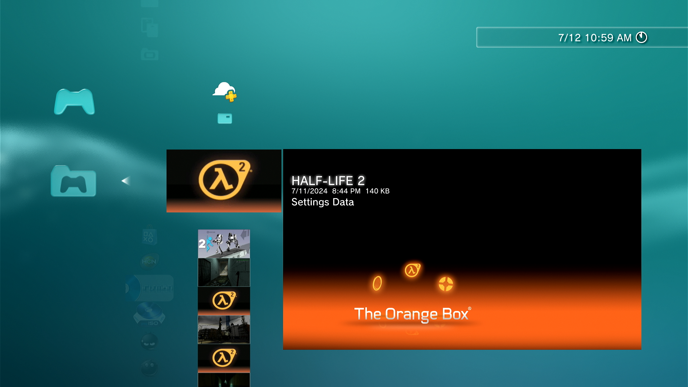
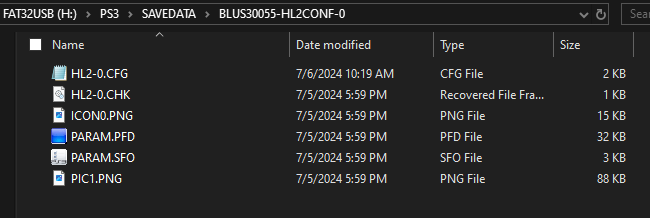
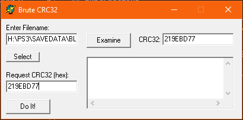
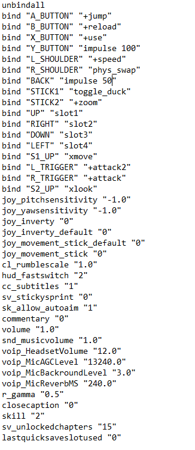
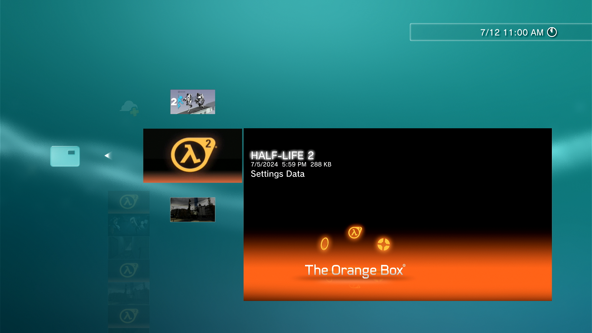

Using save file hacking, it is possible to run console commands and cheats by simply binding them to controller buttons.

Here is a short clip of the beginning of Route Kanal on PS3 with noclip and 40FPS:

<iframe src="demoreel.mp4" width="600" height="371" frameborder="0" style="max-width:100%; vertical-align:middle; text-align:center;" allowfullscreen></iframe>

<small>Note: some web browsers don't like how this video's audio is encoded. Video may be muted.</small>

**Note:** Some commands won't work, such as `developer 1`. Check the [SPMP Wiki](https://sourcespmp.github.io/wiki/PS3/The%20Orange%20Box/index.html) for commands that are known to work/not work. Other than those, most commands *should* work, but no guarantees.

# Tutorial

**Note:** While this is possible on Portal 2, it cannot be done via save file modification and is a much more involved process. Therefore, this tutorial will be for Orange Box only.

## You will need:
- A PS3 (no jailbreak needed!)
- A PC
- A flash drive (MUST be formatted as FAT32. [Check this website for more information.](https://www.freecodecamp.org/news/how-to-format-a-usb-drive-to-fat32-on-windows-10/))
- BruteCRC32 (You can grab this program on our [tools page](/tools-of-the-trade/))

## Instructions

**Note:** Make sure you have played the game you wish to mod at least once, and saved your progress. Otherwise we won't have a save file to mod!

1) Insert the flash drive into your PS3.

2) Navigate to "Saved Data Utility" under "Games". You should see your flash drive at the top of the list like so:

If not, your flash drive may be formatted incorrectly.

3) Navigate to your desired game's SETTINGS save. Ignore any of your actual saves, we don't need them, we are simply modifying a config file.

4) Press triangle, select copy, choose your flash drive. Overwrite if asked.

5) Once the transfer is finished, disconnect the flash drive from your PS3 and insert it into your PS3.

6) On your file browser, navigate to your flash drive>PS3>SAVEDATA. Select your save (look for a folder called HL2CONF or similar) and open it. You will be met with these files:

7) Open BruteCRC32. Click select and navigate to your game's save again. Click on the CFG file. Click Examine.

8) The text box on the right should have been filled with an 8-digit code. Hold onto that code (I recommend copying it into the lower textbox).

9) Now, we can open the CFG file. If asked, open it with Notepad. Do NOT close BruteCRC32 yet.

**Note:** All buttons correspond to an Xbox 360 controller rather than PS3. So A_BUTTON = X, L_SHOULDER = L1, etc.

Simple rebinds include SELECT("BACK"), R1 ("R_SHOULDER"), and R3 ("STICK2"). These can be rebound without losing any crucial functionality. 

You can have some commands execute on save load (or new game) by adding them to the bottom of the file. I added `cl_showpos 1` and `cl_showfps 1` that way.

For Half-Life 2, you can unlock all chapters by setting `sv_unlockedchapters` to `"15"`. This ConVar is part of your save file; don't create a new line or bind for this.

10) When satisfied with your edits, save, leaving an empty line at the bottom of the file.

11) In BruteCRC32, paste your 8-digit code into the bottom text field. Click "Do It!". Wait for the program to figure out a bruteforce.

12) BruteCRC32 will ask you whether to add bytes to the file. click "yes".

**Note:** This prompt should appear less than a minute after starting the process. If you don't see it, click BruteCRC32's icon on the taskbar to bring the program on top of any other programs.

13) Close BruteCRC32 and any other programs accessing your flash drive, and unplug it. Insert the drive into your PS3. 

14) Navigate back to the save data folder on your PS3, and this time select your flash drive. Select your modified save file.

15) Press triangle, select "Copy". You will get two different overwrite prompts, choose "yes" on both of them.

Your binds are now installed on the PS3. Open your game to verify they are working.

**Note:** If you get a "corrupt save file" warning, you didn't use BruteCRC32 correctly which allowed the PS3 to detect that it has been modified. 